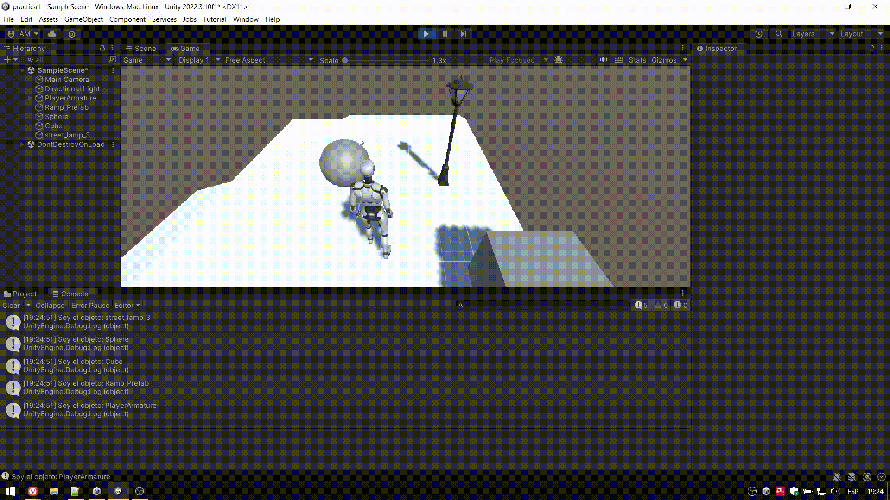

# ii-practica1-introduccion-a-unity
**Autor**: Adriano dos Santos Moreira  

Agregué el jugador usando un prefab de Third Person (de Starter Assets)
y para que se pudiese mover le coloqué un prefab de terreno (también de Starter Assets).
A continuación creé un cubo y una esfera. También puse una farola gratuita de la Asset Store.
Por último hice un script que muestra por consola el nombre de cada objeto.
